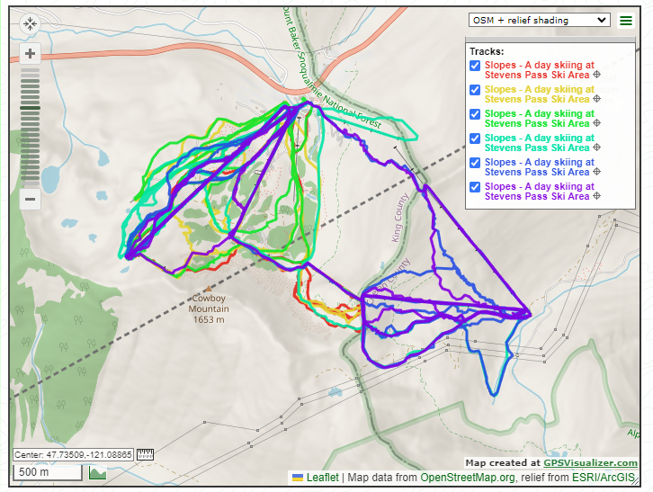

# GPX Combiner

A Python script for combining a bunch of GPX files into one.

## Setup and Use

You'll need lxml, which you should be able to install with `pip install lxml`. If not, have a look at [their instructions](http://lxml.de/installation.html#installation).

Then run from the repo:

```bash
./combiner.py ./gpx/ > combined.gpx
```

Then use [GPS Visualizer](https://www.gpsvisualizer.com/) to view the output. Here's an example output:


